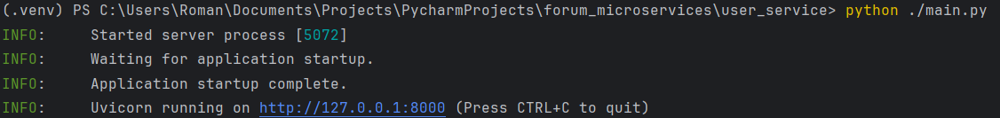
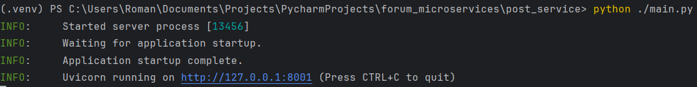
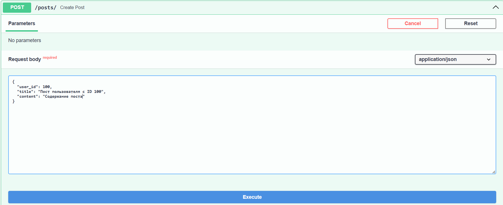
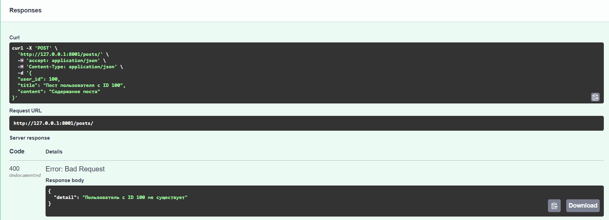
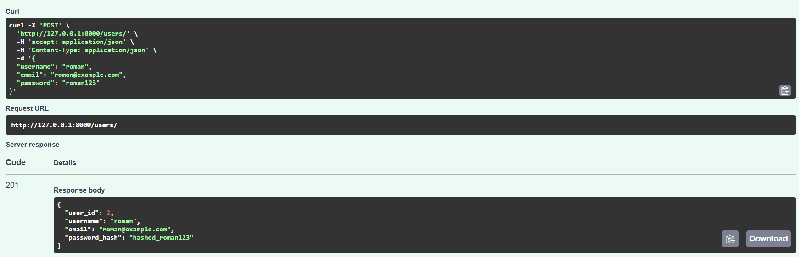
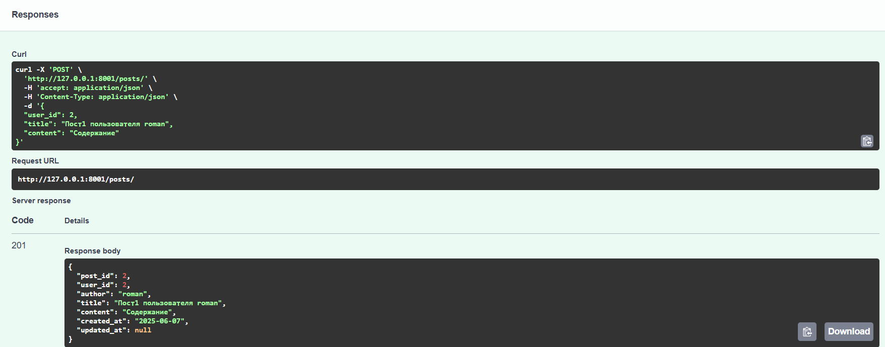
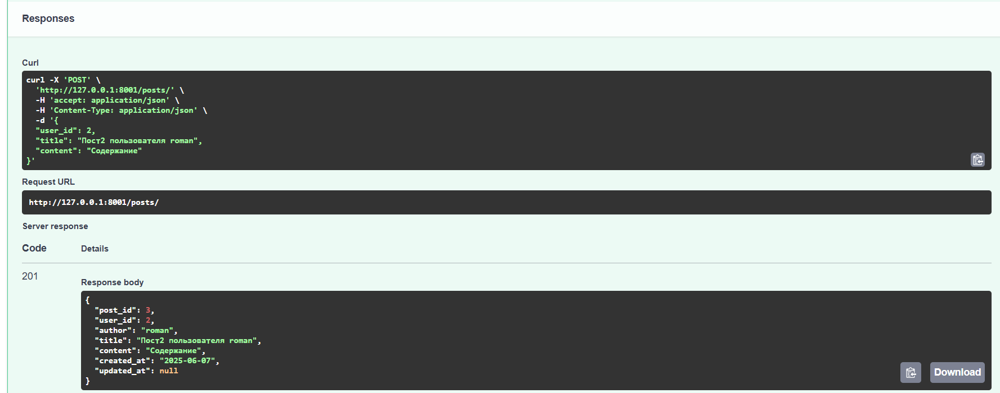
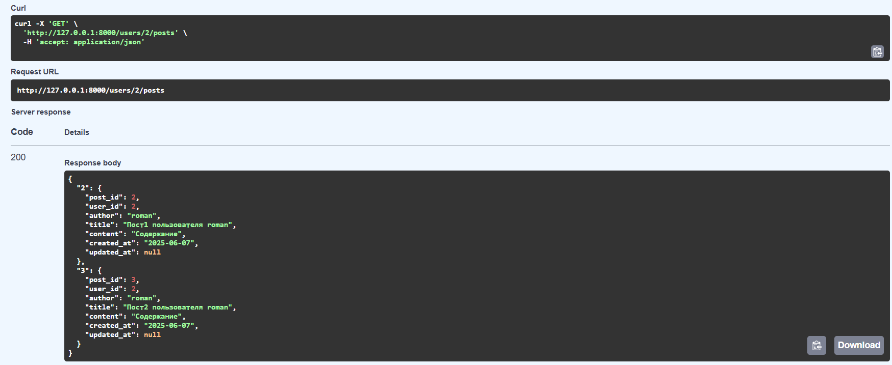

Лабораторная работа №5 Григорьев Роман, 8К21

В ходе лабораторной работы было реализованно два микросервиса User и Post. Для наглядной демонстрации работы двустороннего обмена информации была реализована логика:

1. Проверка существования пользователя при создании нового поста
2. Получение всех существующих постов пользователя

Сначала запускаем микросервисы (микросервис пользователей работает на порте 8000, микросервис постов на 8001):

Созданим пост, указав ID несуществующего пользователя:

Получаем ошибку, что такого пользователя не существует:

Теперь создадим пользователя и 2 поста для него:

1. Создаем пользователя:

2. Создаём 2 поста:

Далее получим все посты пользователя roman:

Таким образом, было разработано 2 микросервиса с двухсторонним обменом информации.